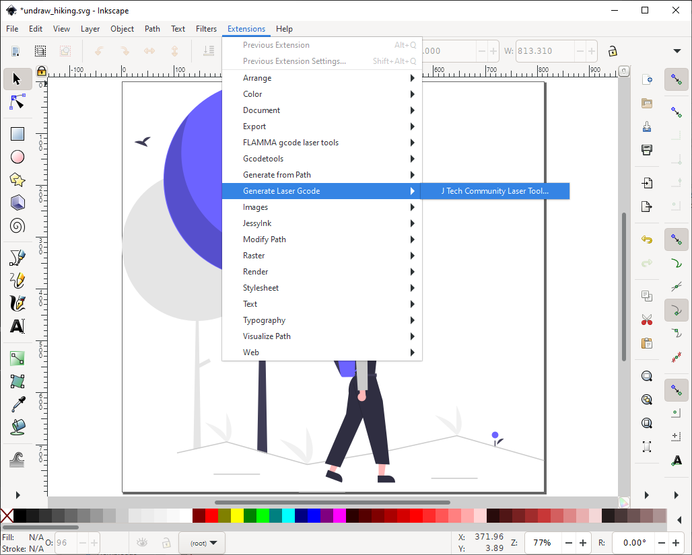

# J Tech Photonics Laser Tool
This Inkscape extension generates a gcode file using all svg paths. All other shapes are ignored.

Previous versions of this extension were based on fairly ancient and unreadable code. In versions 2.0 and beyond, this 
extension has become a wrapper around the new [svg-to-gcode](https://github.com/PadLex/SvgToGcode) library. 
Legacy releases (below 2.0) are available on the [releases page](https://github.com/JTechPhotonics/J-Tech-Photonics-Laser-Tool/releases).
Instructions for older versions can be found on [JTP's website](https://jtechphotonics.com/?page_id=2012).

## Installation

Download the latest release [here](https://github.com/JTechPhotonics/J-Tech-Photonics-Laser-Tool/releases/latest).
Inkscape versions below 1.0 are not supported. Use legacy releases if you are using Inkscape < 1.0.

Unzip the binaries and copy the laser directly into the Inkscape **user extensions folder**. Inkscape lists the location
of your user extensions folder under **Edit** > **Preferences** > **System**.

Restart Inkscape and you're done.

## Tutorial
### Document Setup
Before using the extension, we need to make sure the document is setup correctly.

### Basic Usage

This extension will parse all svg paths and ignore everything else. So step 1 is to convert all other shapes to paths.
In this case I want to convert the whole drawing to gcode. So I select everything `ctr+A` and convert the drawing to paths 
**Path** > **Object to Path**.

## Contribute

* As a user you can contribute by suggesting features, testing the library and reporting any bugs you encounter in a 
detailed issue.
* As a developer of any skill level you can make pull requests which close issues or introdce usefull features.
