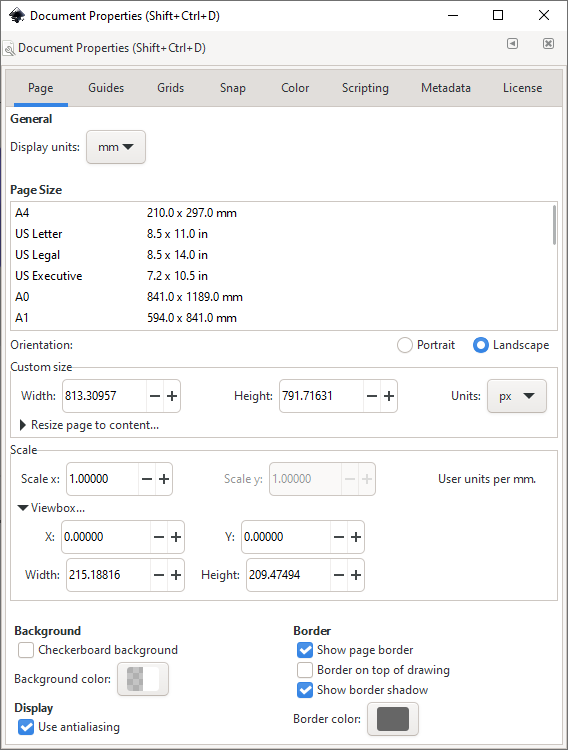

# J Tech Photonics Laser Tool
This Inkscape extension generates a gcode file using all svg paths. All other shapes are ignored.

Version 2.0 just released and there are a lot of changes! If you want you can still access legacy releases (below 2.0) 
 on the [releases page](https://github.com/JTechPhotonics/J-Tech-Photonics-Laser-Tool/releases).
Instructions for older versions can be found on [JTP's website](https://jtechphotonics.com/?page_id=2012).

## Installation

Download the latest release [here](https://github.com/JTechPhotonics/J-Tech-Photonics-Laser-Tool/releases/latest).
Inkscape versions below 1.0 are not supported. Use legacy releases if you are using Inkscape < 1.0.

Unzip the binaries and copy the laser directly into the Inkscape **user extensions folder**. Inkscape lists the location
of your user extensions folder under **Edit** > **Preferences** > **System**.

Restart Inkscape and you're done.

## Tutorial

### Document Setup
Before using the extension, we need to make sure the document is setup correctly. Open **File** > **Document Properties**.

Set the document's **display units** to `mm` or `in`.
Then set **Scale x**, **Scale y** to `1` and **Viewbox > X**, **Viewbox > Y** to `0`.

Lastly, you can move and rescale your drawing to make it look like it did before. 

### Basic Usage

This extension will parse all svg paths and ignore everything else. So step 1 is to convert all other shapes to paths.
In this case I want to convert the whole drawing to gcode. So I select everything `ctr+A` and convert the drawing to paths 
**Path** > **Object to Path**.

Open the extension at **Extension** > **Generate Laser Gcode** > **J Tech Community Laser Tool**

Select the **same unit** you used in the **Document Settings**. Then choose an appropriate output directory and 
hit apply.

You'll notice two layers where added to your document:
* `debug reference points` contains the black corners. They 
represent the four corners of your machine's bed. You can use them to eyeball weather the gcode is scaled and place 
correctly.
* `debug traces` contains the red paths which trace all generated gcode commands. Note: debug layer are reset 
everytime you run the extension, so make sure you don't accidentally add any objects to them.

## Contribute

* As a user you can contribute by suggesting features, testing the library and reporting any bugs you encounter in a 
detailed issue.
* As a developer of any skill level you can make pull requests which close issues or introdce usefull features.
